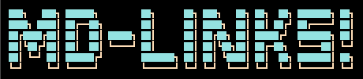

<!-- 
  
 -->
# MD-Links

## Índice

* [1. Definición del producto](#1-definición-del-producto)
* [2. Diagrama de flujo](#2-diagrama-de-flujo)
* [3. Objetivos de aprendizaje](#3-objetivos-de-aprendizaje)
* [4. Checklist](#4-checklist)

## 1. Definición del producto
Librería que permite obtener información de links en archivos markdown, con estadísticas de links totales, únicos y rotos.

## 2. Diagrama de flujo

  

## 3. Objetivos de aprendizaje

### JavaScript

* [X] Uso de condicionales (if-else | switch | operador ternario)
* [X] Uso de funciones (parámetros | argumentos | valor de retorno)
* [X] Manipular arrays (filter | map | reduce)
* [ ] Manipular arrays (sort)
* [X] Manipular objects (key | value)
* [X] Uso ES modules ([`import`](https://developer.mozilla.org/en-US/docs/Web/JavaScript/Reference/Statements/import) | [`export`](https://developer.mozilla.org/en-US/docs/Web/JavaScript/Reference/Statements/export))
* [X] Diferenciar entre expression y statements.
* [X] Diferenciar entre tipos de datos atómicos y estructurados.
* [X] [Uso de callbacks.](https://developer.mozilla.org/es/docs/Glossary/Callback_function)
* [X] [Consumo de Promesas.](https://scotch.io/tutorials/javascript-promises-for-dummies#toc-consuming-promises)
* [X] [Creación de Promesas.](https://www.freecodecamp.org/news/how-to-write-a-javascript-promise-4ed8d44292b8/)

### Node

* [X] Uso de sistema de archivos. ([fs](https://nodejs.org/api/fs.html), [path](https://nodejs.org/api/path.html))
* [X] Instalar y usar módulos. ([npm](https://www.npmjs.com/))
* [X] Creación de modules. [(CommonJS)](https://nodejs.org/docs/latest-v0.10.x/api/modules.html)
* [X] [Configuración de package.json.](https://docs.npmjs.com/files/package.json)
* [X] [Configuración de npm-scripts](https://docs.npmjs.com/misc/scripts)
* [X] Uso de CLI (Command Line Interface - Interfaz de Línea de Comando)

### Testing

* [X] [Testeo unitario.](https://jestjs.io/docs/es-ES/getting-started)
* [X] [Testeo asíncrono.](https://jestjs.io/docs/es-ES/asynchronous)
* [ ] [Uso de librerias de Mock.](https://jestjs.io/docs/es-ES/manual-mocks)
* [ ] Uso de Mocks manuales.
* [ ] Testeo para múltiples Sistemas Operativos.

### Estructura del código y guía de estilo

* [X] Organizar y dividir el código en módulos (Modularización)
* [X] Uso de identificadores descriptivos (Nomenclatura | Semántica)
* [X] Uso de linter (ESLINT)

### Git y GitHub

* [X] Uso de comandos de git (add | commit | pull | status | push)
* [X] Manejo de repositorios de GitHub (clone | fork | gh-pages)
* [X] Colaboración en Github (branches | pull requests)
* [] Colaboración en Github (tags)
* [X] Organización en Github (projects | issues | labels | milestones)

### HTTP

* [ ] Verbos HTTP ([http.get](https://nodejs.org/api/http.html#http_http_get_options_callback))

### Fundamentos de programación

* [X] [Recursión.](https://www.youtube.com/watch?v=lPPgY3HLlhQ)

---

## 4. Checklist

### General

* [ ] Puede instalarse via `npm install --global @anarativa09/md-links`

### `README.md`

* [ ] Un board con el backlog para la implementación de la librería.
* [ ] Documentación técnica de la librería.
* [ ] Guía de uso e instalación de la librería

### API `mdLinks(path, opts)`

* [X] El módulo exporta una función con la interfaz (API) esperada.
* [X] Implementa soporte para archivo individual
* [X] Implementa soporte para directorios
* [X] Implementa `options.validate`

### CLI

* [X] Expone ejecutable `md-links` en el path (configurado en `package.json`)
* [X] Se ejecuta sin errores / output esperado
* [X] Implementa `--validate`
* [X] Implementa `--stats`

### Pruebas / tests

* [X] Pruebas unitarias cubren un mínimo del 70% de statements, functions, lines, y branches.
* [X] Pasa tests (y linters) (`npm test`).
